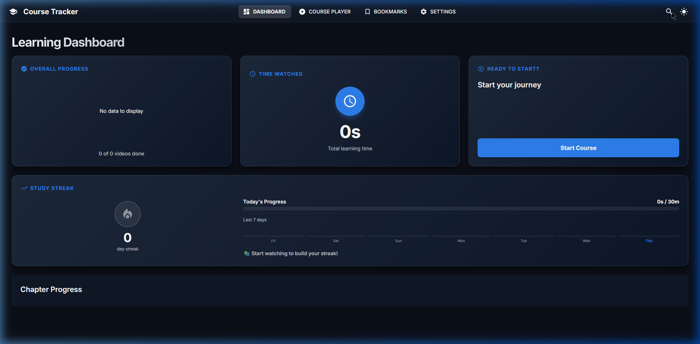

# WatchFlow



WatchFlow is a premium, **local-first** web application designed to help you organize and track your progress through video course materials. Built with **React 19**, **Vite**, and **Material UI 6**, it leverages the modern **File System Access API** to scan your local folders and build an interactive learning experience without ever uploading a single file.

## 🚀 Key Features

- **📂 Instant Local Scanning**: Point WatchFlow to any local folder. It automatically builds a full course curriculum by scanning subfolders (Chapters), videos (`.mp4`), and subtitles (`.srt`).
- **📊 Interactive Dashboard**: Visualize your progress with beautiful MUI X Charts. Track total learning time, completion percentages, and daily activity at a glance.
- **🔥 Study Streaks & Goals**: Stay motivated with daily study goals. The app tracks your consistency and rewards you with a "Day Streak" for meeting your targets.
- **🔖 Bookmarks & Notes**: Save critical moments with a single keystroke (**'B'**). Add notes to bookmarks and jump back to exact timestamps instantly.
- **🎯 Smart Progress Tracking**: Videos are automatically marked as "Completed" once you reach 95% duration. A high-performance "Smart Resume" feature ensures you always pick up exactly where you left off.
- **⚡ High-Performance Player**: Powered by **Vidstack**, the player supports persistent playback speeds (0.5x–2.1x), automatic resuming, and gapless navigation.
- **🌗 Luxury UI**: A fully responsive, premium design with a quick theme toggle in the header, glassmorphic effects, and customizable layouts (Course Outline on left or right).
- **📌 Dynamic Tab Titles**: The browser tab title automatically updates to show the name of your currently selected course.

## 🧠 Technical Excellence (Project Architecture)

### 1. Local-First & Private

WatchFlow operates entirely in your browser. Using the **File System Access API**, it creates secure, temporary Web URLs (Blobs) for your local files. No data is sent to a server, ensuring your course materials remain 100% private.

### 2. Atomic State Management (Jotai)

The application uses **Jotai** for fine-grained state management. By breaking state into independent "atoms" (e.g., `progressAtom`, `themeAtom`), we ensure that high-frequency updates—like video time tracking—never cause unnecessary re-renders in the sidebar, navigation, or dashboard.

### 3. Dual-Layer Persistence (Dexie + Jotai)

To ensure zero data loss and maximum performance:

- **Dexie (IndexedDB)**: Handles heavy lifting like storing your course structure, bookmarked timestamps, detailed watch logs, and secure File System handles. This provides a robust, transacted database layer.
- **Jotai Storage**: Persistent atoms are synced to IndexedDB, allowing for a reactive but permanent state during sessions.

_Detailed architecture can be found in [docs/architecture-details.md](./docs/architecture-details.md)._

### 4. Performance Optimizations

- **Throttled Updates**: Video progress updates are throttled to once every 5 seconds (with immediate persistence on pause, ended, or page unmount), reducing IndexedDB write frequency by 80% while preserving accuracy.
- **Prefetching**: WatchFlow intelligently prefetches both the next/prev video files and their subtitle `.srt` tracks to ensure instant, gapless transitions.
- **Virtualization**: The course outline utilizes native browser virtualization (`content-visibility: auto` and `contain-intrinsic-size`) to handle massive playlists with hundreds of video nodes without performance degradation.

## ⌨️ Keyboard Shortcuts

Focus the player to use these powerful shortcuts:

| Key           | Action                             |
| :------------ | :--------------------------------- |
| `Space` / `K` | Play / Pause                       |
| `F`           | Toggle Fullscreen                  |
| `B`           | Add Bookmark at current time       |
| `←` / `J`     | Rewind 5 seconds                   |
| `→` / `L`     | Fast Forward 5 seconds             |
| `+` / `-`     | Increase / Decrease Playback Speed |
| `.` / `>`     | Next Video                         |
| `,` / `<`     | Previous Video                     |
| `M`           | Mute / Unmute                      |
| `C`           | Toggle Subtitles                   |
| `?`           | Show All Shortcuts                 |

## 🛠️ Setup & Installation

### Prerequisites

- Node.js (v18+)
- A local folder with video files (`.mp4`)

### Installation

1. **Clone the repository**
2. **Install dependencies**
   ```bash
   npm install
   ```
3. **Start the development server**
   ```bash
   npm run dev
   ```

### Quick Start

1. Open the app and click the **Settings** (cog icon) in the header.
2. Click **Browse** and select your course root folder.
3. Grant permissions in the browser popup (WatchFlow only asks for Read access).
4. Start learning!

## 📦 Tech Stack

- **Framework**: [React 19](https://react.dev/)
- **Build Tool**: [Vite](https://vitejs.dev/)
- **UI & Icons**: [Material UI 6](https://mui.com/), [Lucide React](https://lucide.dev/)
- **State**: [Jotai](https://jotai.org/)
- **Video Player**: [Vidstack](https://vidstack.io/)
- **Charts**: [MUI X Charts](https://mui.com/x/react-charts/)
- **Database**: [Dexie.js](https://dexie.org/) (IndexedDB Wrapper)
- **Language**: [TypeScript](https://www.typescriptlang.org/)

---

Built with ❤️ for learners who value Privacy and Performance.
